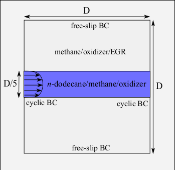
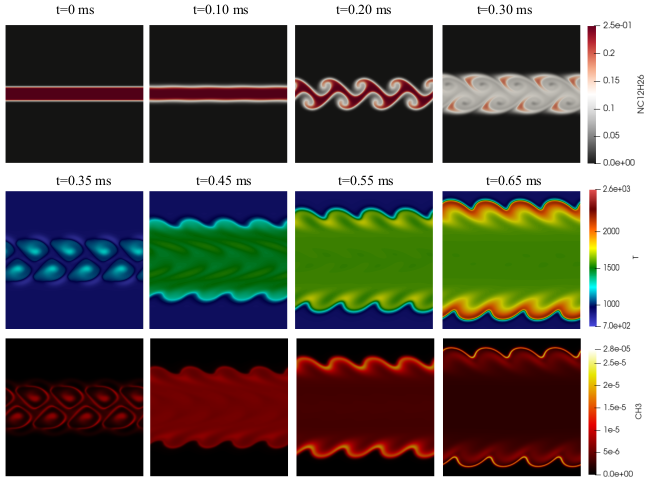

# 2D shear layer

This is a 2D shear layer test case demonstrating capabilities of the DLBFoam, published in Ref.[[1]](#Morev2022)

## Case description

The present 2D shear layer case setup mimics the process of n-dodecane injection in the RCCI combustion, a lean methane/air charge is assumed to be homogeneously distributed through the computational domain. The n-dodecane is assumed to move with a relative velocity in the middle of the domain and two mixing layers develop between the two fuel streams, consquenlty inducing inhomogeneties in the composition and temperature fields.

<p align="center">
  
</p>

## Numerical setup

### Mesh

The number of grid points in both directions is 300 which is based on the pre-estimated laminar flame thickness for n-dodecane/
methane premixed flame at the corresponding most reactive mixture fraction, p = 60 bar, and T reactants = 800 K (flame thickness ≈ 50 μm) to resolve the flame by 10 grid points.
### Boundary conditions

The relative velocity, temperature, and species composition of the n-dodecane jet are specified by a tan hyperbolic profile function. 

### Chemistry

A Yao chemical kinetics mechanism is used [[2]](#Yao2016), compiled for the use with DLBFoam.

### Other details

Example of other details:  

Implicit Large-Eddy Simulation approach is used here, i.e. LES-like mesh is used with filtered equations, but no explicit TCI model is present (in [constant/combustionProperties](constant/combustionProperties) entry ```combustionModel``` is set to laminar).

In DLBFoam library, both load balancing and reference mapping are enabled. Improved ODE solution routines are also utilized.

## Running

You can execute ```Allrun``` script directly, which will set up the case and launch the simulation.

Below is step-by-step guide how to run the case manually.

1. Source OpenFOAM environment. If you use Ubuntu and you have installed the OpenFOAM 8 using package manager, run  
```
source /opt/openfoam8/etc/bashrc
```  
2. Set your number of cores to the ```numberOfSubdomains``` entry of the [system/decomposeParDict](system/decomposeParDict)  
3. Copy the ```0``` folder  
```
cp -r 0.orig 0
```  
4. Run ```blockMesh``` to generate the mesh:  
```
blockMesh
```  
5. Run ```decomposePar``` to decompose your domain according to your number of processors, as configured in (system/decomposeParDict)[system/decomposeParDict] dictionary:  
```
decomposePar -force
```  
6. Run the solver ```reactingFoam``` in parallel (replace NP in the command with your number of cores):  
```
mpirun -np NP reactingFoam -parallel
```  
7. Reconstruct previously decomposed domain for faster post-processing:  
```
reconstructPar
```  

## Post processing

In order to to post-process the simulation data, you can use paraview to observe cutplanes of different fields.


<p align="center">
  
</p>

**Total speed-up compared to standard OpenFOAM solver was around 65.**

## References

<a id="Morev2022">[1]</a>
I. Morev, B. Tekgül, M. Gadalla, A. Shahanaghi, J. Kannan, S. Karimkashi, O. Kaario, V. Vuorinen, Fast reactive flow simulations using analytical Jacobian and dynamic load balancing in OpenFOAM, arXiv preprint arXiv:2105.12070 (2021).

<a id="Yao2016">[2]</a>
T. Yao, Y. Pei, B. J. Zhong, S. Som, T. Lu, K. H. Luo, A compact skeletal mechanism for n-dodecane with optimized semi-global low-temperature chemistry for diesel engine simulations, Fuel 191 (2017) 339–349. doi:10.1016/j.fuel.2016.11.083.
