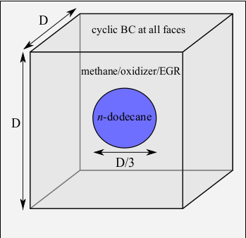
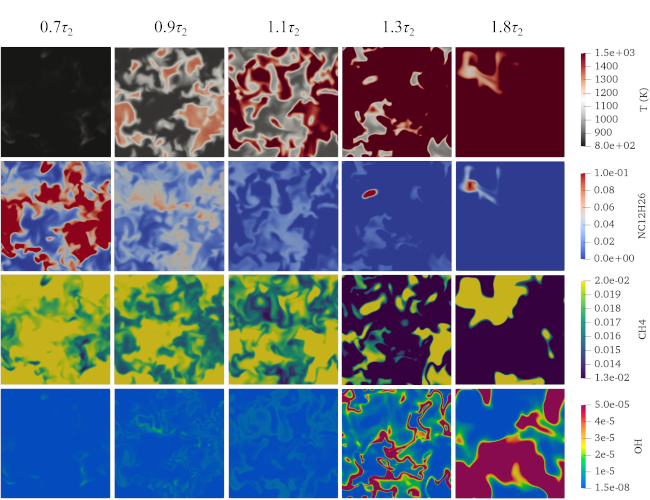

# 3D stratified combustion

This is a 3D stratified test case demonstrating capabilities of the DLBFoam, published in Ref.[[1]](#Morev2022)

## Case description

The case represents a simple approach to study dual-fuel stratified combustion of diesel/methane with a direct relevance to flame initiation in diesel spray assisted ignition of methane. 

<p align="center">
  
</p>

## Numerical setup

Pure $n$-dodecane (diesel surrogate) is initially constrained in a blob in the middle of the domain with a diameter and the ambient gas consists of lean premixed methane, oxidizer and EGR (phi=0.5).The computational domain is a 3D cube with  and a side length of 1 mm. The initial pressure is set at 60 bar and the initial temperature is homogeneous within the entire computational domain at 800 K. Turbulence is initialized using Taylor-Green-Vortex (TGV) structure, which is generated in a separate non-reactive 3D simulation until the gradient of total kinetic energy reaches its peak. Velocity and pressure fields are mapped to the reactive case as initial fields. The estimated Reynolds number at the start of reacting simulation is around 1000.

### Mesh

Mesh is 3D, Cartesian and uniform. The grid size is 4 micro-meter with 256 grid points along each direction, to capture the flame with at least 10 grid points within the laminar flame thickness.

### Boundary conditions

Periodic boundary conditions are considered in all directions.

### Chemistry

A Yao chemical kinetics mechanism is used [[2]](#Yao2016), compiled for the use with DLBFoam.

### Other details

Implicit Large-Eddy Simulation approach is used here, i.e. LES-like mesh is used with filtered equations, but no explicit TCI model is present (in [constant/combustionProperties](constant/combustionProperties) entry ```combustionModel``` is set to laminar).

In DLBFoam library, both load balancing and reference mapping are enabled. Improved ODE solution routines are also utilized.

## Running

You can execute ```Allrun``` script directly, which will set up the case and launch the simulation.

Below is step-by-step guide how to run the case manually.

1. Source OpenFOAM environment. If you use Ubuntu and you have installed the OpenFOAM 8 using package manager, run  
```
source /opt/openfoam8/etc/bashrc
```  
2. Set your number of cores to the ```numberOfSubdomains``` entry of the [system/decomposeParDict](system/decomposeParDict)  
3. Copy the ```0``` folder  
```
cp -r 0.orig 0
```  
4. Run ```blockMesh``` to generate the mesh:  
```
blockMesh
```  
5. Run ```decomposePar``` to decompose your domain according to your number of processors, as configured in (system/decomposeParDict)[system/decomposeParDict] dictionary:  
```
decomposePar -force
```  
6. Run the solver ```reactingFoam``` in parallel (replace NP in the command with your number of cores):  
```
mpirun -np NP reactingFoam -parallel
```  
7. Reconstruct previously decomposed domain for faster post-processing:  
```
reconstructPar
```  

## Post processing

In order to to post-process the simulation data, you can use paraview to observe cutplanes of different fields.

<p align="center">
  
</p>

**Total speed-up compared to standard OpenFOAM solver was around 400.**

## References

<a id="Morev2022">[1]</a>
I. Morev, B. Tekgül, M. Gadalla, A. Shahanaghi, J. Kannan, S. Karimkashi, O. Kaario, V. Vuorinen, Fast reactive flow simulations using analytical Jacobian and dynamic load balancing in OpenFOAM, arXiv preprint arXiv:2105.12070 (2021).

<a id="Yao2016">[2]</a>
T. Yao, Y. Pei, B. J. Zhong, S. Som, T. Lu, K. H. Luo, A compact skeletal mechanism for n-dodecane with optimized semi-global low-temperature chemistry for diesel engine simulations, Fuel 191 (2017) 339–349. doi:10.1016/j.fuel.2016.11.083.
