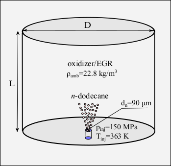
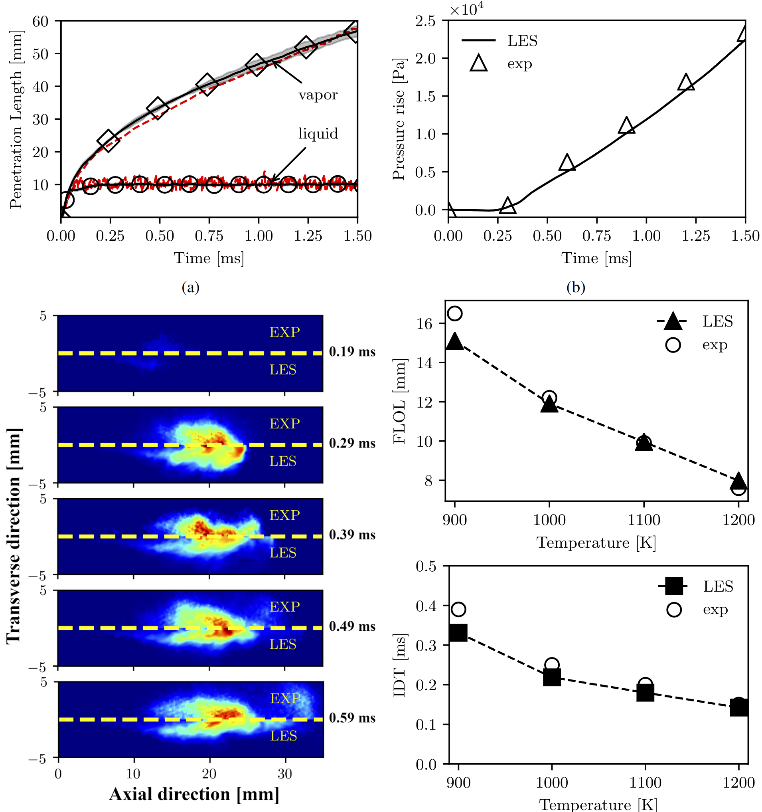

# ECN Spray A

This is a demonstration of the capabilities of the **DLBFoam** on the well-known spray combustion test case [ENC Spray A](https://ecn.sandia.gov/diesel-spray-combustion/target-condition/spray-ab/) experimental setup, published in Ref. [[1]](#Morev2022)

## Case description

ECN Spray A, from the Engine Combustion Network, represents an igniting non-premixed diffusion flame under engine-relevant conditions.

A schematic diagram of the computational setup is demonstrated in the figure below, where the domain dimensions D and L are chosen accordingly to correspond to the volume of ECN combustion vessel by Sandia. Liquid n-dodecane at a temperature of 363 K and pressure of 150 MPa is injected from a 90 μm nozzle (i.e., Spray A) into a hot quiescent ambient gas of density 22.8 kg/m3 and mixture composition of (15% O2, 75.15% N2, 6.23% CO2, and 3.62% H2O) based on the molar fractions.

<p align="center">
  

*<div align="center">Schematic diagram of the ECN Spray A combustion vessel by Sandia, along with operating conditions for spray injection and hot ambient gas.</div>*

</p>

## Numerical setup

### Mesh

The computational domain depicts a cylinder that has a volume equivalent to the ECN combustion vessel by Sandia. The geometrical discretization is performed to reach resolution of 62.5 microns within the spray cone volume. Mesh refinement is achieved through consecutive cell-splitting procedure using the ```refineMesh``` utility.

### Spray modeling

A customized model for spray injection sub-model has been implemented which extends the cone disc injection (i.e. 2D surface) into a 3D model. 
In the customized model, computational Lagrangian parcels are randomly injected from cylinder of fixed height. The parameters for position, direction, cone angles, and disc inner and outer diameters are all preserved for the new model, while the parameters hCylinder and offsetCylinder are required to set the cylinder height and offset from injector position. Therefore, instead of injecting parcels over a disc (i.e. 2D surface), they are introduced randomly within a 3D finite volume cylinder.

More information can be found from [ConeCylinderInjection repository on Github](https://github.com/Aalto-CFD/ConeCylinderInjection), as well as Ref. [[2]](#Gadalla2020)

### Chemistry

A chemical kinetics mechanism developed by Yao et al [[3]](#Yao2016), involving 54 species and 269 reactions, is used. Such a mechanism is compiled for the use with DLBFoam.

## Execution

After sourcing OpenFOAM 8, download and compile the [ConeCylinderInjection library](https://github.com/Aalto-CFD/ConeCylinderInjection) using `Allwmake` in that repository. 

After that, link the library during solver runTime. This is achieved by adding the following to `system/controlDict` of the simulation case directory.

```
libs
(
    "libconeCylinderInjection.so"
);
```

Finally, execute ```Allrun``` script of the ECN_Spray_A case, which will set up the case and launch the simulation.

## Validation

The ECN Spray A case in this repository was used to benchmark and validate DLBFoam v1.1 library [[1]](#Morev2022).

<p align="center">
  
</p>

**Total speed-up compared to standard OpenFOAM solver was around 256.**

## References

<a id="Morev2022">[1]</a>
I. Morev, B. Tekgül, M. Gadalla, A. Shahanaghi, J. Kannan, S. Karimkashi, O. Kaario, V. Vuorinen, Fast reactive flow simulations using analytical Jacobian and dynamic load balancing in OpenFOAM, [doi:10.1063/5.0077437](https://doi.org/10.1063/5.0077437) (2022).

<a id="Gadalla2020">[2]</a> 
M. Gadalla, J. Kannan, B. Tekgül, S. Karimkashi, O. Kaario, V. Vuorinen.
Large-Eddy Simulation of ECN Spray A: Sensitivity Study on Modeling
Assumptions. Energies. 13(13):3360.
[doi:10.3390/en13133360](https://doi.org/10.3390/en13133360) (2020).

<a id="Yao2016">[3]</a>
T. Yao, Y. Pei, B. J. Zhong, S. Som, T. Lu, K. H. Luo, A compact skeletal mechanism for n-dodecane with optimized semi-global low-temperature chemistry for diesel engine simulations, Fuel 191, 339–349, [doi:10.1016/j.fuel.2016.11.083](https://doi.org/10.1016/j.fuel.2016.11.083) (2017) .
