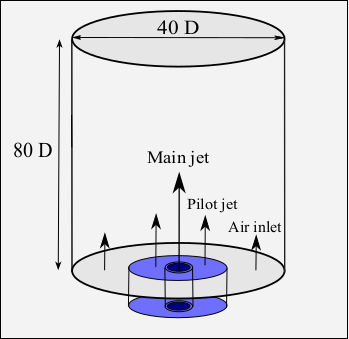
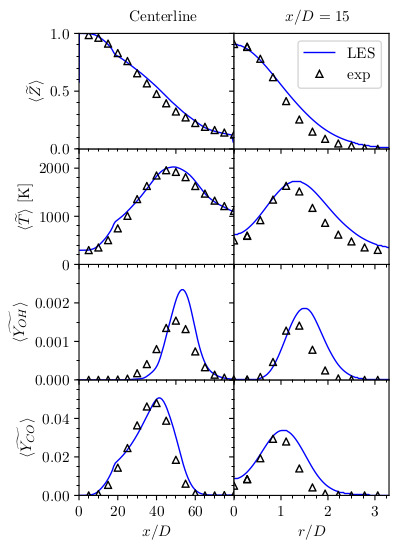
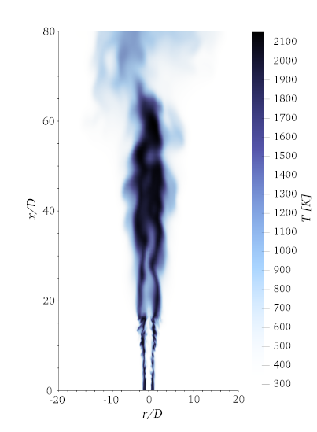

# Sandia flame D

This is a demonstration of the capabilities of the DLBFoam on the well-known [Sandia flame D](https://tnfworkshop.org/data-archives/pilotedjet/ch4-air/) experimental setup, published in Ref.[[1]](#Morev2022) 

## Case description

Sandia flame D - is a partially-premixed piloted methane/air jet flame. The main jet is a mixture of methane and air at equivalence ratio 3.17. Pilot jet is a mixture of a combustion products at temperature 1880K. The main jet nozzle inner diameter is D=7.2mm, whereas pilot jet has inner and outer diameters of 7.7mm and 18.2mm correspondingly. The main jet velocity is 49.6m/s, pilot jet velocity is 11.4m/s and air coflow velocity is 0.9m/s. More details on the setup can be found in Ref.[[2]](#Barlow1994).

<p align="center">
  
</p>

## Numerical setup

### Mesh

Computational grid is Cartesian with a refinement region close to the nozzle. In order to save computational resources, maximum mesh resolution is put close to the nozzle to capture the physics only close to the first sampling location. The refinement start with a cylinder zone with diameter 3·D and length 7·D. Then it continues as a cone with height 7·D and second diameter 4·D. The stl, used for the refinement, can be found in [constant/triSurface/refinement.stl](constant/triSurface/refinement.stl).
Refinement is done using ```refineMesh``` utility with a refinement zone set up in [system/refineMeshDict](system/refineMeshDict). After the mesh is refined, inlet patches are set using ```topoSet``` and ```createPatch``` utilities. 

### Boundary conditions

Intlet velocity profiles for main and pilot jets are set with ```codedFixedValue``` boundary condition, where experimental profiles are imposed. On top of the experimental profile for main jet, a turbulence of the form proposed by Pitsch and Steiner [[3]](#Pitsch2000) is superimposed. Turbulence parameters are generated randomly by a python script [generate_turbulence_params.py](generate_turbulence_params.py), called by ```Allrun```.

### Chemistry

A DRM19 chemical kinetics mechanism is used [[4]](#DRM19), compiled with for the use with DLBFoam. 

### Other details

Implicit Large-Eddy Simulation approach is used here, i.e. LES-like mesh is used with filtered equations, but no explicit TCI model is present (in [constant/combustionProperties](constant/combustionProperties) entry ```combustionModel``` is set to laminar).

Data averaging is done by ```fieldAverage```, activated after a time required for the jet to become statistically stable. 

In DLBFoam library, both load balancing and reference mapping are enabled. Improved ODE solution routines are also utilized.

## Running

You can execute ```Allrun``` script directly, which will set up the case and launch the simulation.

Below is step-by-step guide how to run the case manually.

1. Source OpenFOAM environment. If you use Ubuntu and you have installed the OpenFOAM 8 using package manager, run  
```
source /opt/openfoam8/etc/bashrc
```  
2. Set your number of cores to the ```numberOfSubdomains``` entry of the [system/decomposeParDict](system/decomposeParDict)  
3. Copy the ```0``` folder  
```
cp -r 0.orig 0
```  
4. Using python, run script that generates random parameters for turbulence and writes them to ```0/U``` file:  
```
python generate_turbulence_params.py
```  
5. Run ```blockMesh``` to generate corse mesh for the whole domain:  
```
blockMesh
```  
6. Run ```refineMesh``` to apply refinement, as configured in the (system/refineMeshDict)[system/refineMeshDict] dictionary:  
```
refineMesh
```  
7. Run ```topoSet``` to choose boundary faces to use as inlet, as configured in (system/topoSetDict)[system/topoSetDict] dictionary:  
```
topoSet
```  
8. Run ```createPatch``` to set up new inlet patches after refinement, as configured in (system/createPatchDict)[system/createPatchDict] dictionary:  
```
createPatch -overwrite
```  
9. Run ```decomposePar``` to decompose your domain according to your number of processors, as configured in (system/decomposeParDict)[system/decomposeParDict] dictionary:  
```
decomposePar -force
```  
10. Run the solver ```reactingFoam``` in parallel (replace NP in the command with your number of cores):  
```
mpirun -np NP reactingFoam -parallel
```  
11. Reconstruct previously decomposed domain for faster post-processing:  
```
reconstructPar
```  
## Post processing

In order to to post-process the simulation data, you can sample the lines you are interested in from the averaged fields (e.g. ```UMean```, ```TPrime2Mean```).

## Validation

The Sandia flame D case in this repository was used to benchmark and validate DLBFoam v1.1 library [[1]](#Morev2022).

<p align="center">
  
  
</p>

**Total speed-up compared to standard OpenFOAM solver was around 13.5.**

## References

<a id="Morev2022">[1]</a> 
I. Morev, B. Tekgül, M. Gadalla, A. Shahanaghi, J. Kannan, S. Karimkashi, O. Kaario, V. Vuorinen, Fast reactive flow simulations using analytical Jacobian and dynamic load balancing in OpenFOAM, arXiv preprint arXiv:2105.12070 (2021).

<a id="Barlow1994">[2]</a> 
Barlow, R. S., and C. D. Carter. "Raman/Rayleigh/LIF measurements of nitric oxide formation in turbulent hydrogen jet flames." Combustion and Flame 97.3-4 (1994): 261-280.

<a id="Pitsch2000">[3]</a> 
Pitsch, Heinz, and Helfried Steiner. "Large-eddy simulation of a turbulent piloted methane/air diffusion flame (Sandia flame D)." Physics of fluids 12.10 (2000): 2541-2554.

<a id="DRM19">[4]</a> 
A. Kazakov, M. Frenklach, Reduced Reaction Sets based on GRI-Mech 1.2, http://combustion.berkeley.edu/drm/, accessed: 2021-10-21 (2005).
